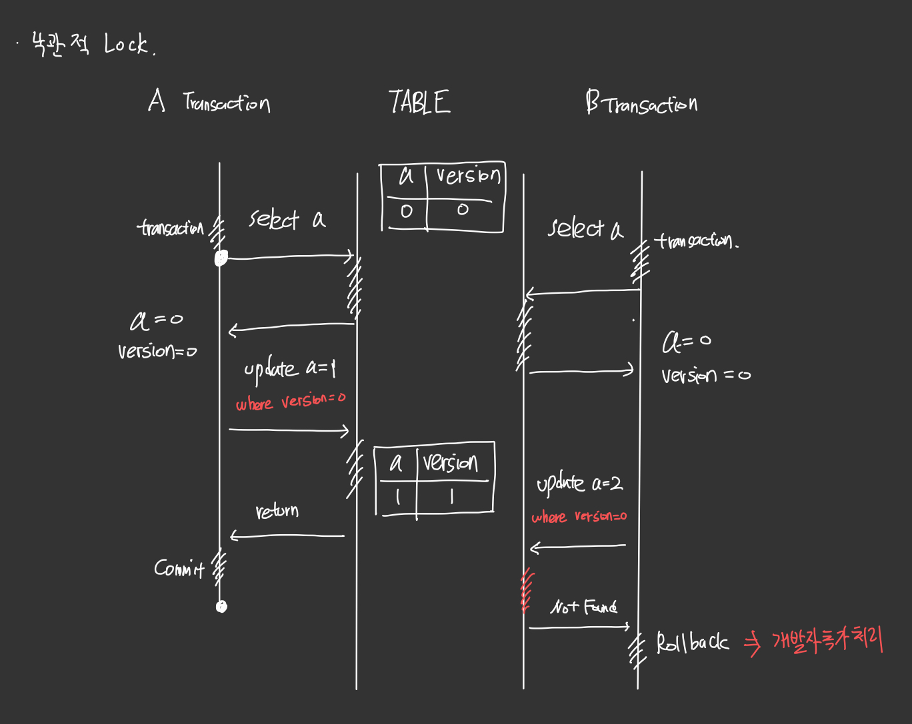
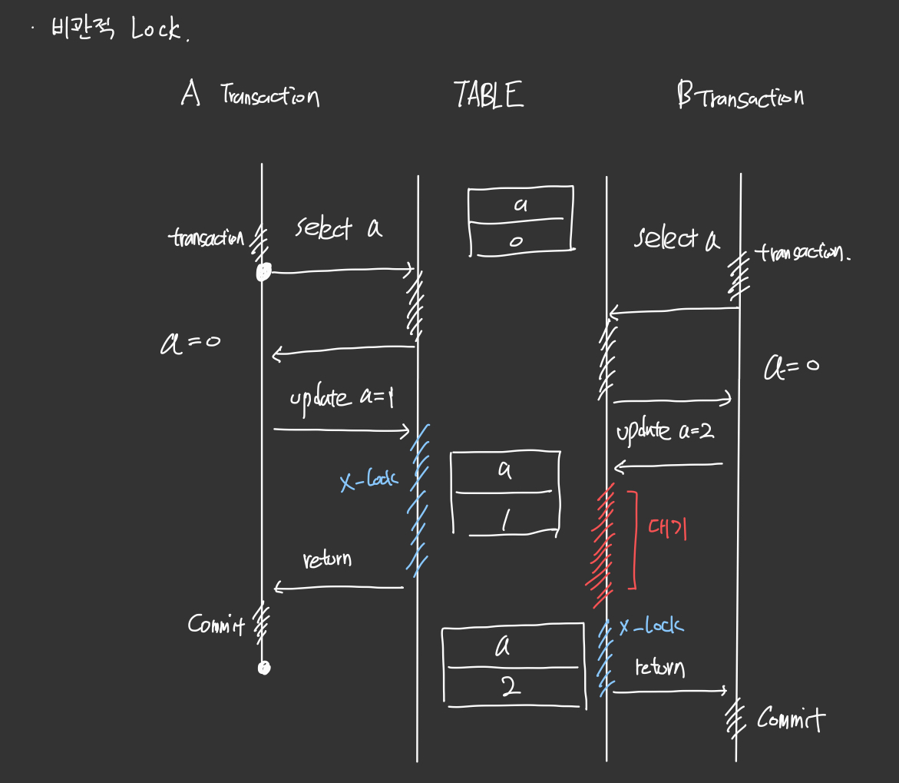

# LOCK 
***
데이터 베이스에는 `Lock` 의 개념이 있다 

`Lock` 이란 동시성 문제와 관련된 기술로 

하나의 `Row` 에 먼저 확보한 트랜 잭션 이외에 

다른 트랜잭션을 동시에 접속하시 못하도록 다른 접속을 제어하는 기술이다 

Lock 의 종류로는 [공유 Lock](#공유-lock---shared-lock), [베타 Lock](#배타-lock---exclusive-lock)이 있다

이러한 Lock 이 있을 때 

동시에 DB 를 조작할 경우 Lock 의 조건 때문에 DB 충돌이 일어날 수 있다.

그런 충돌을 방지하는 방식들이 바로 [낙관적 Lock](#낙관적-lock---optimistic-lock-), [비관적 Lock](#비관적-lock---pessimistic-lock-) 이 있다.

이러한 충돌을 제대로 해결하지 못한 경우 [Dead Lock](#데드락---dead-lock) 이라는 현상이 발생하여 

아무것도 못하는 현상이 발생한다.

## Lock 종류 
*** 
## 공유 Lock - Shared Lock
### [설명]
흔히 말하는 `S-Lock` 이라고 불리우며
트랜잭션이 진행 중에도 다른 트랜잭션의 내용은 읽을 수 있도록 하는 `Lock` 이다. (즉 읽기 전용)

트랜잭션이 동작하는 중에는 읽어야하는 `Row` 에 `S-Lock` 을 걸고서 진행을 한다 
다른 트랜잭션이 해당 `Row` 을 읽을 때는 걸려있는 `S-Lock` 을 획득하여 읽을 수 있는 권한을 얻어 
해당 `Row` 을 읽을 수 있다.

`S-Lock` 은 여러행에 중복으로 걸 수 있다는 것 때문에
다른 트랜잭션에서 읽을 수 있고 심지어 동시에 읽을 수 있기도 하다.

## 배타 Lock - Exclusive Lock
흔히 말하는 `X-Lock` 이라고 한다. 
이는 읽기 전용이 보단 쓰기 전용 Lock 이라고 보면된다.

대부분의 `Insert Query`, `Update Query` 에 기본적으로 들어가고

해당 Row 에 대해서 하나의 트랜잭션이 잠금을 할 수 있다. 
하지만 베타락이 생성하게 되면 해당 `Row` 에는 `S-Lock` 을 걸수 없게 된다.

즉 쓰는 트랜잭션이 끝날 때까지 다른 트랜잭션은 아무것도 할 수 없게 된다.
그래서 `Row data` 가 일정할 수 있는 것 같다.

 

## 동시성 충돌 방지 종류 

***
## 낙관적 LOCK - Optimistic Lock 

`낙관적이다`는 말처럼 이는 `Transaction` 간의 충돌 에 대해 별로 신경을 안쓰는 것으로 

충돌이 일어날 가능 성이 있다.

각각의 트랜잭션 들은 생성할떄 계속해서 증가하는  `Version` 이라는 정보를 갖고 생성된다.

그리고 해당 `Transaction` 마다 버전을 비교하여 이후의 적용된 `Version` 은 `ROLLBACK` 하는 방법 이다.

즉 해당 방법은 Version 에 따라 실패할 수 있기 때문에 

실패를 해도 다시 시작할 수 있는 상황에 적용하는 것이 적절한 것 같다.

그래서 병목현상도 없을 것 같지만 `RollBack` 이 나왔을 때 재시도하는 추가 시도를 해야하는 것이 단점인 것 같다.

 

## 비관적 LOCK - Pessimistic Lock 

낙관적 Lock 에서 성능을 조금 포기한 대신 확실한 방법으로 

Version 이라는 정보도 없이 어느한 트랜잭션에서 수정을 할 경우 

해당 트랜잭션을 제외한 모든 트랜잭션을 기다리게 끔하여 동시성을 해결하는 방식이다.

다만 성능을 포기한 만큼 병목현상이 있을 수 있고 

하나의 트랜잭션이 끝날 나는 것이 오래 걸릴 수 도 있기 때문에 `TimeOut` 을 설정해야한다.

> [개인 적인 주관]  
> 비관적 락을 사용할 때는 반드시 `TIMEOUT` 을 설정해야 하는 것 같다.  
> `TIMEOUT` 을 설정하지 않는다면 `X-LOCK` 을 얻기 위해 요청하는 순간 
> `TIMEOUT` 값이 설정되지 않아 기다리지 않고 바로 FAIL 처리가 났었다.

***

# 데드락 - Dead Lock

트랜잭션을 진행할 때 해당 Row 에 적절한 Lock 을 얻질 못해서 

아무 행동도 하지 못하고 무한정 기다리는 현상으로

해당 Lock 을 얻기 전에 사라진 경우가 대다수 이다.

이를 해결하기 위한 방법으로는 

* 순서를 일정하게 이용 하는 방법 
* 트랜잭션 범위를 작게 하는 방법

이 있다.