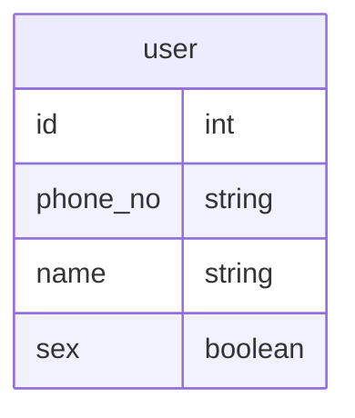

# [MYSQL] - DB INDEX 설정 방법
***

순서정렬을 미리 저장하여 조회 성능을 올려주는 Index 를 MYSQL 에서 설정하는 방법이다.


## Table 구조 


## 인덱스 조회
``` mysql
SHOW INDEX FROM [테이블명];

# 예시
SHOW INDEX FROM user;
```


<table>
<thead>
    <tr>
        <td>Table</td>
        <td>Non_unique</td>
        <td>Key_name</td>
        <td>Seq_in_index</td>
        <td>Column_name</td>
        <td>Collation</td>
        <td>Cardinality</td>
        <td>Sub_part</td>
        <td>Packed</td>
        <td>Null</td>
        <td>Index_type</td>
        <td>Comment</td>
        <td>Index_comment</td>
        <td>Visible</td>
        <td>Expression</td>
    </tr>
</thead>
<tbody>
    <tr>
        <td>테이블 명</td>
        <td>Not 유니크 설정 </td>
        <td>인덱스 이름</td>
        <td>인덱스 적용 순서</td>
        <td>적용된 컬럼</td>
        <td>-</td>
        <td>중복도 <br> (높을수록 좋음)</td>
        <td>-</td>
        <td>-</td>
        <td>-</td>
        <td>인젝스 구조</td>
        <td>주석</td>
        <td>-</td>
        <td>표기 여부</td>
        <td>-</td>
    </tr>
</tbody>
</table>


## 인덱스 생성 

[공식 문서](https://dev.mysql.com/doc/refman/8.4/en/create-index.html)
``` mysql 
CREATE [UNIQUE | FULLTEXT | SPATIAL] INDEX index_name
    [index_type]
    ON tbl_name (key_part,...)
    [index_option]
    [algorithm_option | lock_option] ...

index_option: {
    KEY_BLOCK_SIZE [=] value
  | index_type
  | WITH PARSER parser_name
  | COMMENT 'string'
  | {VISIBLE | INVISIBLE}
  | ENGINE_ATTRIBUTE [=] 'string'
  | SECONDARY_ENGINE_ATTRIBUTE [=] 'string'
}

index_type:
    USING {BTREE | HASH}

algorithm_option:
    ALGORITHM [=] {DEFAULT | INPLACE | COPY}

lock_option:
    LOCK [=] {DEFAULT | NONE | SHARED | EXCLUSIVE}

```

* 일반적인 작성
``` mysql
# 기본
CREATE INDEX [인덱스 이름] ON [테이블 이름]([컬럼 이름])

# 에시
CREATE INDEX idx_user_phone ON user(phone_no)

```

* 전체 옵션 적용 예시
  * `unique` 추가
  * `comment` 추가
  * `Hash` 구조 
  * `parser` 추가
  * `visible` 옵션 추가

```mysql
CREATE UNIQUE INDEX idx_user_phone_no USING HASH 
    ON user(phone_no ASC) 
    COMMENT "새로운 주석입니다." 
    with parser "parser_name" 
    VISIBLE
```


## 인덱스 삭제
``` mysql
DROP INDEX [인덱스 이름] FROM [테이블 이름]
```


## 마무리 
MYSQL 을 사용할 경우 해당 방법을 통해 인덱스르 잘 걸어서 

검색 효율을 크게 올리도록 하자!