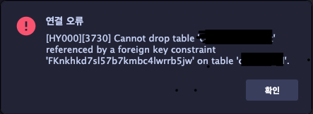
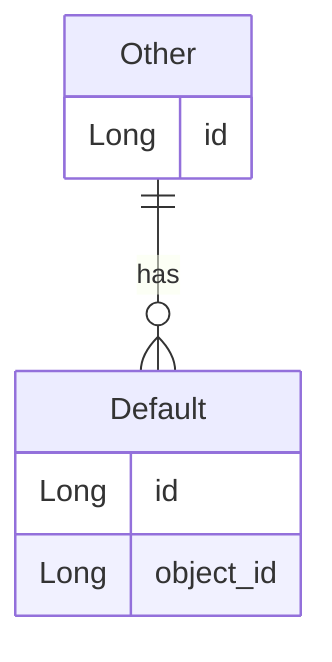
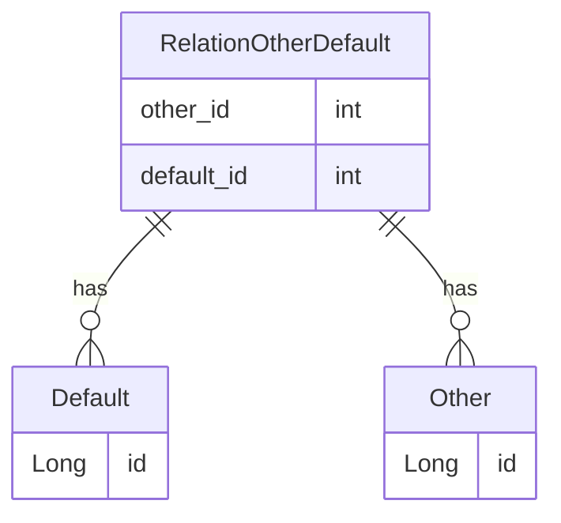

# JoinColumn VS JoinTable
*** 

개발을 진행하면서 `JPA Entity` 를 설정할때 자동완성 덕분에 겪었던 에러를 공유하고자 합니다.

## 예러 발생상황

`OtherEntity` 를 생성후 

`DefaultEntity` 와 관련된 `Entity` 를 설정하다 발생을 하였고


```java

    // OtherEntity
    @Entity
    @Table(name="other")
    class OtherEntity{
        @Id @GeneratedValue(strategy = GenerationType.AUTO)
        private Long id;
    
    }
```


```java
    // DefaultEntity
    @Entity
    @Table(name="default")
    class DefaultEntity {

        @Id @GeneratedValue(strategy = GenerationType.AUTO)
        private Long id;
    
        @ManyToOne(fetch = FetchType.LAZY)
        @JoinTable(name="other_id", foreignKey=@ForeignKey(ConstraintMode.NO_CONSTRAINT))
        private OtherEntity other;
    
    }

```


해당 부분이 잘못된줄도 모르고 그냥 진행을 했었다가 `Table Column` 이 이생하게 생성이 되었다.

`Default Table` 의 `Column` 이 `Id` 밖에 생기질 않았고

`other_id` 에 대한 `Column` 이 생기질 않았다. 

그래서 이상함을 느껴 `table` 삭제를 하려고 했더니..!




### 삭제가..안된다...!?


여기서부터 의아했던 점이 한두가지가 아니었고 

해결하기 위해  

### 1. `ForeignKey` 삭제
단순히 우선 삭제를 해보려고 시도를 했었다.

`ForeignKey` 제약 설정은 


`information_schema.table_constraints` 에서 확인 할 수 있으므로

```mysql
    select * from informain_schema.table_constraints;
```

에서 확인한 `CONSTRAIN_NAME` 일라고 적힌 `COLUMN` 을 기억했다가

ForeignKey 를 제거하는 명령어인 다음을 입력했지만 

```mysql 
    alter table concert_cast_list drop foreign key [CONSTRAIN_NAME];
```


`information_schema` 테이블은 `Root` 권한이 있어야 수정을 할 수 가 있었다.

권한을 준 이후 삭제를 하면 되긴 하겠지만 권한까지 줘가면서 수정하기엔 너무 무리인 것같아

다른 방법을 찾아봤다.

### 2. `FK` 확인 변수 삭제 

인터넷 조회를 좀 해보니 `FK` 확인을 하는 `foreign_key_checks` 이라는 값이 있는데 

해당 값을 `0` 으로 만들어주면 `FK` 제한에 상관 없이도 해당 `Table` 을 지울 수 있다고 들었다.

```mysql
set foreign_key_checks = 0;
```
으로 만든후 

```mysql
drop table default;
```

테이블일 삭제하니 정상적으로 삭제가 되었다.


### 여기서 한가지 의문점이 생겼었는데 

바로 왜 이런 일이 벌어졌을까 였다.

물론 이제 지우는 방법을 알았지만 

시험삼아 다른 `Table` 을 지웠을 때는 아무 이상없이 지워졌기 때문이다.

해당 `Table` 에서 하나만 생성된걸 단서를 삼아 다시 자세히 보니 

이번 포스팅의 제목처럼 `@JoinColumn` 라고 되어야하는 곳에 `@JoinTable` 이라고 되어있었다.

이것을 다시 `@JoinColumn` 으로 바꾸니 원래 정상적으로 진행이 되었다. 


## `@JoinColumn`
다른 `Table` 의 `Column` 을 외래키로 만들어서 생성되는 방식으로 
해당 `Column` 에는 `Join` 이 될 `Table` 의 `id` 가 생성이 된다.



## `@JoinTable `
다른 `Table` 과 외래키를 맺는 것은 맞으나 
별도의 관계 `Table` 을 생성해서 외래키를 맺는다.




### 이제서야 밝혀지는 에러의 상황...

`DefaultEntity` 에서 `other_id` 가 없는 이유는 명확했다.
당연히 다른 테이블을 생성했기 때문에 없었던 거고

제약조건이 생긴 이유도 다른 `Table` 에서 외래키를 맺으니 생성이 된 것이였다.

다시 확인해보니 이를 정의하기 위한 새로운 `Table` 도 확인했다.


## 차이 비교 
### `@JoinTable`
* 해당 `Table` 을 새롭게 만드는 것으로 기존의 관계도를 구현하는 방식이다 
* `Table` 전체를 이용해서 다른 `Table` 과 `JOIN` 해야하기 때문에 `OneToOne`, `ManyToOne` 에서는 성능이 좋지 않다.
* 확장을 할때 간편하다 - 기존의 `Table` 에서 `Column` 추가 없이도 구현할 수 있다.

### `@JoinColumn`
* 다른 `Table JOIN` 시 바로 `JOIN` 이 가능하므로 간편하고 성능이 좋다.
* 다만 `ManyToMany` 의 경우 새로 `Table` 이 만들어져야만 하므로 사용할 수 없다.
* 새로운 `Colum` 을 추가해야 하는 단점이 있다.


### 마무리
각 장단점 별로 추후 사용할 때는 헷갈리지 말고 
사용할 수 있도록 해야곘다!


대략 적으로 정리하자면 

`ManyToMany` -> `JoinTable`   
`OneToOne`, `ManyToOne` -> `JoinColumn`  


으로 알고 있어도 무방해 보이지만   
역시 자세한건 실제 상황마다 상황을 고려해가면서 적용하는 것이 좋을 것 같다.


## 참고 문헌
***
* [StackOverFlow](https://stackoverflow.com/questions/30288464/when-should-i-use-joincolumn-or-jointable-with-jpa)