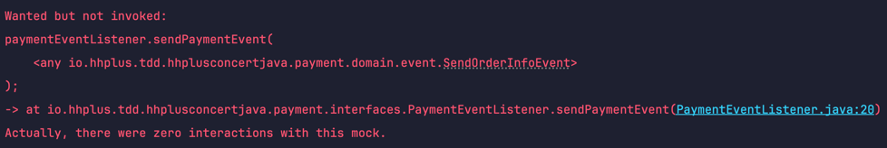

# [Mockito] `@Mock` 과 `@MockBean`
***

`JUNIT` 으로 테스트 코드를 짜다가 

통합 테스트에서 이벤트 리스너로 등록된 개체가 

비동기로 작동됨으로 이벤트를 잘 받아서 호출하는지

`MOCKING` 하여 알고 싶었다.

그래서 평소처럼 `@MOCK` 을 이용하여 작성하였다가 에러가 났었다.

```java


@SpringBootTest
@ExtendWith(MockitoExtension.class)
class testCase{
    @Mock // 호출 확인해야하는 객체
    EventPublish eventPublish;
    
    @Test 
    public void 테스트_함수(){
        // 테스트 작성
    }
}

```




해당 에러는 `Mocking` 이 제대로 안되었다는 뜻이다.


단위 테스트 에서 잘만 작동하던 `Mock` 이 잘 작동이 안되네..!?


그래서 찾아본 결과 

`@MockBean` 이라는 어노테이션을 이용해야 테스트가 되는 걸 알았다.

### `@MockBean`
`Spring Application Context` 에 있있는 객체를 `MOCK` 함수로 대체해주는
어노테이션 이다. 

따라서 지금 내가 테스트를 하는 부분은 이벤트 동작이 제대로 맞는가?
를 테스트하는 통합테스트임으로 

`MOCK` 으로 대체를 하려면 `@MockBean` 을 이용해야한다.


