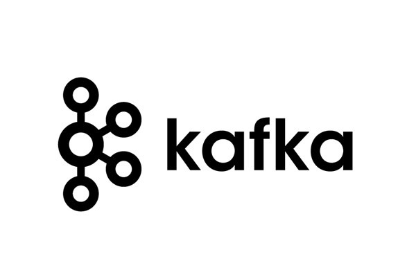

# Kafka
***

 

## Intro
*** 

카프카..카프카...

개발하다 막혀보거나 여러 기술 스택을 들어보면 

어쩌다가 가끔씩 들리는 카프카 

대충 듣기로는 이벤트 중심의 어쩌구 저쩌구..고가굥성어쩌구..

느낌으로는 Docker 처럼 DevOps 같은 생각도 든다.

그런 느낌만 갖고 그런가보다...하는 사이

운좋게 카프카에 대해 배울 기회가 생겨서 배우면서 알게된 부분을 

정리하는 시간을 갖고자 한다 

  

## About Kafka 
*** 
### 그래서 카프가가 뭐임?

우선 정확한 명칭은 아파치 카프카(Apache Kafka) 이다.

정확히 뭐지? 라는 걸 알기 위해 카프카 [공식 문서](https://kafka.apache.org/documentation/#gettingStarted)에 따르면 아래 같이 문장이 써져있다.

> 아파치 카프카는 이벤트 스트리밍 플랫폼 입니다.

그럼 이벤트 스트리밍은 뭘까?

> 
> 이벤트 스트리밍은 인체의 중추 신경계의 디지털 버전입니다. 
> 이는 기업이 점점 더 소프트웨어로 정의되고 자동화되고 소프트웨어 사용자가 더 많은 소프트웨어인 '항상 켜진' 세상을 위한 기술적 기반입니다.
> 
> 기술적으로 말하면, 이벤트 스트리밍은 데이터베이스, 센서, 모바일 기기, 클라우드 서비스, 소프트웨어 애플리케이션과 같은 이벤트 소스에서
> 이벤트 스트림 형태로 실시간으로 데이터를 캡처하는 관행입니다. 
> 이러한 이벤트 스트림을 나중에 검색할 수 있도록 내구성 있게 저장합니다. 
> 이벤트 스트림을 실시간으로 그리고 회고적으로 조작, 처리 및 반응합니다. 
> 그리고 필요에 따라 이벤트 스트림을 다른 대상 기술로 라우팅합니다. 
> 
> 따라서 이벤트 스트리밍은 적절한 정보가 적절한 시간에 적절한 장소에 있도록 데이터의 지속적인 흐름과 해석을 보장합니다.

### 음..길ㄷㅏ...

간단히 정리하자면 스트리밍이란 언어와 라우팅이라는 단어 덕분인지 실시간 처리가 된다는 의미와 

이벤트를 기반으로 다른 대상에게 전달하는 기능을 가진 플랫폼인 것 같다.

마치 중추 신경계처럼 다른 서비스 에서 신호를 보내면 중심적으로 갖고 있다가

뿌려주는 기능을 가진 것 같다. 

 

  

## 이벤트
*** 
### 우선 이벤트 구조부터 알아보자!

이벤트 형식은 단순히 key, value, header 의 조합으로 되어있다.

value 는 대표적으로 String 형식이지만 Bit, Byte 등 다른 방식도 지원한다.

안타까운건 Object 형식은 지원하지 않아서 일일이 파싱하여 사용해야한다..!

header 는 추가 메타 데이터를 심거나 구분하기위한 용도로 사용한다

  

## 구성 요소 
*** 

### 이벤트 구조도 알았으니 다음은 카프카 구조!

카프카의 구성요소는 크게 다음과 같다. 

* ### 브로커 (Broker) :: 발생한 이벤트를 잘 분배하여 정리함
* ### 프로듀서  (Producer) :: 카프카에게 이벤트 발생함
* ### 컨슈머 (Consumer) :: 카프카가 정리한걸 가져감

 

### 브로커 (Broker)
해당 기능의 전체 관리자 라고 할 수 있다. 

이벤트들이 발생하게 되면 각 이벤트를 적절한 곳에 라우팅도 해주고 

이벤트에 대한 모니터링, 교통 저리, 등등을 할 수 있는 헤더 라고 볼 수 있다.

> 이벤트를 받고 분배하여 분류하여 정리함에 쌓아놓는 역할!

### 프로듀서 (Producer)

실제 이벤트를 생성하는 역할을 가진 프로듀서는 이벤트를 발생시켜 브로커에게 알려주는 역할이다. 

기본적으로 카프카에서 생성하는 것이 아니다.

즉, 외부 프로그램에서 카프카와 연결을 하면 되고 연결하는 부분이 프로듀서의 역할을 갖게 된다.   

브로커와 프로듀서로 연결할 수 있다면 프로듀서가 된다. 

> 이벤트를 발생하는 트리거의 역할

### 컨슈머 (Consumer)

프로듀서가 브로커에게 이벤트를 전달하면 카프카가 잘 정리해서 함에 쌓아두면

컨슈머는 일정 시간마다 (거의 실시간) 으로 정해진 함을 확인하게 되면서 

새로 들어온 이벤트가 있나 없나를 확인하여 가져간다. 

마치..오늘은 편지가 왔나? 하고 집앞 우편함을 확인하는 것과 같다.

> 이벤트를 확인하고 가져가는 역할

이렇게 크게 3개의 역할이 단순히 이벤트를 실시간으로 스트리밍 하기 위해 구성되어있다. 

그래서 단순히 다음과 같이 정리가 된다.

### 카프카는 여러 서비스들을 이벤트 기반으로 분산하거나 연결할때 사용한다.
그것이 대용량 트래픽일 수도, 이벤트 분리일수도 있다!

 

## Broker 의 분배/ 분산 방법
***
### 그래서 이벤트를 어떻게 분산/ 분배하는 거지?

우선 이벤트의 분리 기준은 Topic 에 있다. 

이벤트마다 Topic 으로분리가 되며 하나의 Topic 에는 Partition 이라는 큐가 존재한다. 

이 부분은 설정마다 다르게 해줄 수가 있다.

Partition 은 하나의 이벤트가 들어올 떄마다  쌓이는 함이라고 볼 수 있고

Partition 이 결정되는 방식은 각 이벤트별 Key 를 hash 값으로 변환 후 Partition 의 개수만큼 나눈 나머지가 특정 partition 이 결정 된다.

즉, 이벤트가 대용량으로 많이 들어와도 파이션이 많으면 동시에 병렬적으로 처리할 수 있으므로 분산을 할 수가 있다.

결과론적으로는 Topic, Key 에 의해 분산 처리가 가능하다.

또한 Broker 의 수를 늘리는 것도 분산 처리가 가능하도록 하는 방법이다. 

 

## Broker 설정
*** 
### 오..그럼 브로커를 한번 설정해볼까..?

브로커 즉 카프카를 설치하려면 한가지 주의점이 있다. 

바로 ZOOKEEPER 라는 (동물원?)  서버를 먼저 켜놓고 실행해야한다.

### ZOOKEEPER 가 무엇..!?
[블로그](https://data-engineer-tech.tistory.com/4) 을 참조해보면 

분산 코디네이터 서비스 라고 하는데 

데이터를 어떻게 저장하는 방법..? 에 대한 오픈소스인 것 같다. 

카프케에서는 주로 Topic 생성, 삭제 등의 정보를 저장하는 데사용한다고 하고 

대용량 트래픽 인경우 다른 서버에 놓아도 무방한다고 한다

### 하지만 지원을 곧 중단한다고하니 버전을 잘보고 설치하자!

> 주의! ZooKeeper 지원 중단  
> Apache Kafka 3.5가 출시됨에 따라 Zookeeper는 더 이상 사용되지 않습니다.   
> ZooKeeper는 Apache Kafka(버전 4.0)의 다음 주요 릴리스에서 제거될 예정이며,  
> 이는 2024년 4월 이전에는 예정되어 있지 않습니다. 
> 사용 중단 단계 동안 ZooKeeper는 여전히 Kafka 클러스터의 메타데이터 관리를 지원하지만 새로운 배포에는 권장되지 않습니다. 
> KRaft에 구현되어야 하는 작은 하위 집합의 기능이 있습니다. 
>자세한 내용은 현재 누락된 기능을 참조하세요.

## Producer 설정 
***
### 그럼 이벤트를 어떻게 발행하지?

이 부분은 외부 서비스마다 구현 방식은 다르지만 대부분 프레임 워크나, 언어별 라이브러리가 있으니 

해당 라이브러리를 참조하면 된다! 

이때 연결하는 방식은 다른 어플리케이션 처럼 TCP 통신을 이용하여 연결하니 

네트워크 설정이 필요하다. 

또한 어떤 Topic 의 event 를 발행할건지도 설정 해야한다!

[ 대표적인 설정 ]
* host url
* topic 

  

## Consumer 설정
*** 
### 그렇다면 Consumer 도 비슷한건가?

비슷하다. 다만 Producer 와 다르게 GroupId 도 설정을 해줘야한다.

GroupId???

Consumer 또한 여러 외부 서비스에 의해 설정하기 마련이므로 여럭 컨슈머를 사용할 수 있다. 

즉, Topic1 하나의 Consumer 를 8개나 붙여도 상관이 없다. 

> 그럼 1개보다 8배 빠르게 이벤트 처리르 할 수 있겠지!! Goooooood

그런데 여기서 한가지 문제점이 8개의 Consumer 를 사용하는데 이게 순차적으로 처리된다고 한다면 

하나의 컨슈머는 8개 마다 이벤트를 받는 꼴이 된다. 

이때, 하나의 이벤트를 2개의 컨슈머가 동일하게 받게 하고 싶은 생각이 자연 스레 들게 되는데..!

> 예를 들면,   
> 결제 이벤트가 발생했을 때, slack 알람, 통계 지표업데이트, 메일 보내기 등등 후처리 업무가 포함된 경우!

이럴 때 사용하는게 GroupId 이다.

같은 GroupId 에서는 8개의 컨슈머를 두면 8개의 컨슈머가 돌아가면서 이벤트 처리를 하지만

연결된 GroupId 마다 같은 이벤트가 처리가 된다. 

따라서 slack 알람 GroupId, 통께 지표 업데이트 GroupId 를 지정하면 

2개의 이벤트가 동시에 발생하는 것이니 GroupId 또한 설정을 해줘야한다!

## OUTTRO
*** 
지금까지 카프카에 대한 기본적인 정리를 해보았다.  

카프카는 이벤트 스트리밍 플랫폼이고   

브로커, 프로듀서, 컨슈머 3개의 구성요소로   

이벤트를 발행하면 컨슈머로 설정된 여러 곳에서 동시에 처리할 수 있는 기능이다.  

이벤트를 잘 설정하면 각 여러 서버를 두므로써 대용량 트래픽도 분산할 수 있고,   

이벤트 분리로 비지니스로직을 분리할 수 있으니   

적재 적소에 잘 이용하는게 좋을 것 같다!
