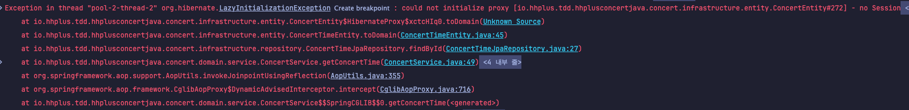
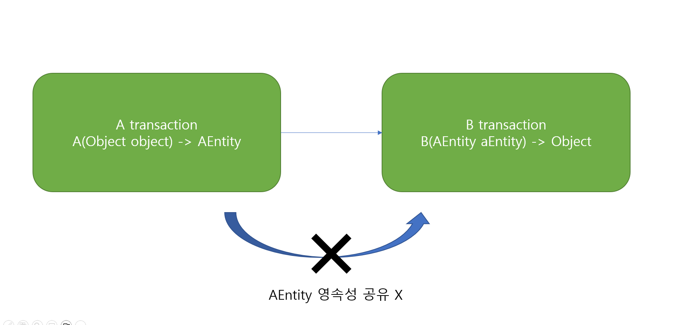

## 시작 하며

항해플러스라는 개인적인 성장을 하기 위해 시작했었던 기간중 동시성 테스트에 대해 처음 접하기도 하였고   
평소 단순히 트랜잭션만 사용하면 되겠지 하는 단순한 생각만 있었다가 직접 경험해보고 나니 생각보다 구현시 고려할 부분이 많고 헷갈렸던 기억이 많아 정리를 하고 싶어서 이 글을 시작하게 되었습니다.


## 해결 해야할 문제

일반적인 동시성 문제 였으며 상황을 가정하여 콘서트 예약 서버가 주어졌습니다.

### 조건
* 다중 인스턴스 상황
* 좌석 예약 API 는 동시에 요청한다.
* 최대 좌석수 이후 좌석 신청을 하게 되면 예약에서 없어져야한다.


이런 당연하고 간단한 조건이였다.


처음에는 당연히 트랜잭션만 잘 설정하면 되겠지 하며 코드를 작성했다.
그리고 처음에는 `Facade` 기능을 잘 이용하고 싶어서 여러 서비스의 조합과 메소드를 최대한 이용 했다


``` java 

	// ConcertFacade 
	class ConcertFacade {
    
    	UserService userService
    	ConcertService concertService
     
    
    	public void reserve(long concertId, long concertTimeId, long concertSeatId, long userId){
        		
                
             // domain 객체 가져오기 Service 함수
             User user = this.userService.getUser(userId);
             
             Concert concert = this.concertService.getConcert(concertId);
             
             ConcertTime concertTime = this.concertService.getConcertTime(concertTimeId);
             
             ConcertSeat concertSeat = this.concertService.getConcertSeat(concertSeatId);
             
             
             // 실제 예약 생성 
             Reservation reservation = this.concertService.reserve(concert, concertTime, concertSeat, user);

        	
        }
    
    }

```


``` java 
	// ConcertService
   	class ConcertService {
    	
        ConcertSeatRepository concertSeatRepository
        ConcertTimeRepository concertTimeRepository
        ReservationRepository reservationRepository
    
        @Transactional
    	public Reservation reserve(Concert concert, ConcertTime concertTime, ConcertSeat concertSeat, User user){
        		
                
            // 도메인 로직 진행
        	concertSeat.reservation();
          	
            
            // 새로운 추가된 Resrvation 
           	Reservation preReservation = Reservation.build()
            		.concertSeat(concertSeat)
                    .concertTime(concertTime)
                    .concert(concert)
                    .user(User)
            		.builder();
            
            
            // 중복 CHECK 을 확인하는 방법 ( 같은 시간 AND 같은 자리 조회시 ERROR ) 
           	Reservation duplicateCheck = this.reservationRepository.duplicateCheck(reservation)
            if(duplicateCheck != null ){
            
            	throw new BusinessError("이미 예약이 확정된 좌석입니다.");
            }
            
            // 생성후 Return 
            return this.reservationRepository.save(preReservation);
            
            
        }
    }

```


간단하게 작성해보면 다음과 같이 작성을 하고 단순히 `Transaction` 이제 걸어야하는데
`Transaction` 은 범위가 작을 수록 좋고 성능도 좋아 진다고 하여

`Service` 단에서 `reserve` 하는 `Service` 에 걸었다.


그리고는 테스트 작성 후 테스해 보았지만 발생한 에러는 `NO_SESSION ERROR` (다중 Thread 라서 Error 로그가 혼잡함)




## 아니 대체 왜..?

이를 위해 에러 코드를 검색해보았는데 `EntityManager` 와 관련된  `Error` 였다


`JPA Repository` 에서 사용하는 `EntityManager` 는 기본적으로 `Transaction` 이 생성되면 이후에 실행되는 `Query` 는 자체로 1차 캐시를 적용하고 

트랜잭션이 끝난 이후 `Query` 를 날리는 방식으로 운영된다고 했다.

검색하면서 알게된 부분이지만 꽤나 효율적이라고 생각했다. 

캐시를 이용하여 여러 비교를 한후 마지막 결과만! 저장하니 말이다 

그래서 생각해보면 당연했다 

기본적으로 Transaction 에서 사용하는 건데 save 를 사용하는...Reserve 에서만 save 를 사용하잖아?

여기서 한번 더 혼란이 왔었다. 

EntityManger 의 동작원리를 몰라서 단순히 Save Method 가 사용되는 경우라면 되는 줄알았다.

되지 않은 이유는 단순히 Entity 간의 영속성이 Transaction 마다 다르기 때문이라고 한다.




즉 Facade 처음 시작의 각각의 Entity 들과 Transaction 을 사용하게 된 ConcertService.reserve 내부의 Entity 들은

다르다 

처음 Entity -> Transactional 이 없기 때문에 EntityManger 가 없음 

ConcertService.reserve -> Transactional 있기 때문에 EntityManger 가 있음 

따라서 서비스 내부의 save 함수 실행시 인자로 넘겨준 Entity 에는 Session 관리를 해주는 EntityManger 가 없어서 에러가 났던 것이라 생각했다.


그래서 처음부터 Entity 를 관리하게끔 Session 연결을 위해 Facade Method 에 Transactional 을 붙였다.


``` java 

	// ConcertFacade 
	class ConcertFacade {
    
    	UserService userService;
    	ConcertService concertService;
     
        @Transactional
    	public void reserve(long concertId, long concertTimeId, long concertSeatId, long userId){
        	
                
             // domain 객체 가져오기 Service 함수
             ...
             // 실제 예약 생성 
             Reservation reservation = this.concertService.reserve(concert, concertTime, concertSeat, user);

        	
        }
    
    }

```


그랬더니 다행히 `NO_SESSION ERROR` 는 일어나지 않았지만 동시성으로 인한 에러가 났다.

5명이 한자리를 갖고 동시에 요청했지만 5명이 전부 예약이 생성되는 문제 말이다.


이제서야 LOCk 이라는 개념이 어쩔 수 없이 꼭 필요하구나 라고 느꼈다.

다행히 해당 과제중 DB LOCK 이라는 걸 이용하라고 힌트를 줘서 다행이였다.

대충 인터넷 알아보니 데이터 베이스에서 동시성 요청을 막기 위해 트랜잭션 사용시 해당 자원을 다른 트랜잭션으로부터 막는 기술이였다.

`S-LOCK` 이라는 건 읽기는 허용하지만 쓰기가 되질 않는 것 
`X-LOCK` 이라는 건 읽기, 쓰기 둘다 되지 않도록 막는 것 

이런 차이였다.

그리고 이런 LOCK 기술을 이용하여 동시성을 해결하려면 

Version 을 이용한 낙관적 LOCK, 하나의 트랜젹션만 허용하는 비관적 LOCK 이라는 방법이 존재했다. 

그래서 단순히 자리를 차지하는 것은 정확히 한사람을 제외한 나머지는 탈락 시켜야하므로 비관적 LOCK 을 거는 방법을 찾기 시작했다.

이때 블로그의 글을 대충 읽고 생각한 부분이

> 비관적 LOCK 을 이용해서 다른 트랜잭션은 대기하도록 하고  
> 처음 트랜잭션은 쓰기 작업을 진행하겠지     
> 그치만 기다리는 걸 줄이면 더 효율적이지 않을까..?  
> 그럼 읽기를 허용하는 `PESSIMISTIC_READ` 를 걸면 되겠군

이였다.. 

### 결과는 당연히 실패였지만 어이가 없게도 다른 `PESSIMISTIC_WRITE` 역시 실패를 했었다.


이 부분을 이해하는데 제일 시간이 오래 걸린 것 같았다.


우선 코드부터 손을 보았다.

단순히 왜 중복이 것을 못가져올까?

### 범위가 많아서 그런가?

아까도 말했지만 뭔가 여러 조합을 이룬 Facade Method 에서 생성이 되었고 

Transaction 이 크게 잡혀서 그런게 아닐까..?

하고 단순하게 어려 Table 조회하지 말고 최대한 적은 Table 만 할 수있도록 새로운 `ServiceMethod` 를 만들었다.


``` java 

	// ConcertFacade 
	class ConcertFacade {
   
    	ConcertService concertService;
     
        @Transactional
    	public void reserve(long concertId, long concertTimeId, long concertSeatId, long userId){
        	
            
             // 실제 예약 생성 
             Reservation reservation = this.concertService.reserve(concertSeatId, userId);

        	
        }
    
    }

```


``` java 
	// ConcertService
   	class ConcertService {
    	
        ConcertSeatRepository concertSeatRepository;
        ReservationRepository reservationRepository;
        
        UserRepository userRepository;
        
    	public Reservation reserveV2(long concertSeatId, long userId){
        		
                
            ConcertSeat concertSeat = this.concertSeatRepository.findById(concertSeatId);
                
            User user = this.userRepository.findById(userId);
                
            // 도메인 로직 진행
            concertSeat.reservation();
          	
            
            // 새로운 추가된 Resrvation 
            Reservation preReservation = Reservation.build()
                        .concertSeat(concertSeat)
                        .concertTime(concertSeat.concertTime)
                        .concert(concertSeat.concertTime.concert)
                        .user(User)
                        .builder();
            
            
            // 중복 CHECK 을 확인하는 방법 ( 같은 시간 AND 같은 자리 조회시 ERROR ) 
            Reservation duplicateCheck = this.reservationRepository.duplicateCheck(reservation)
            if(duplicateCheck != null ){
            
            	throw new BusinessError("이미 예약이 확정된 좌석입니다.");
            }
            
            // 생성후 Return 
            return this.reservationRepository.save(preReservation);
            
            
        }
    }

```


하지만 이렇게 수정을 해도 여전히 같은 문제해 도달했다..

효과가 있었던건 바로 LOCK 을 거는 위치 였다...!

이전까지는 사실 LOCK 에 대한 이해가 별로 없어서 아무 어노테이션을 붙이면 대충 LOCK 되는 거겠지 했었다.

알고보니 LOCK 의 기능은 쿼리를 할 때 어떤 LOCK 을 얻을 것인지 설정을 하는 것 같았고 (상호 작용을 위해)

Insert, Update, Delete 쿼리는 기본적으로 데이터 정합성을 위해 X-LOCK 을 기본적으로 설정 하고 작업을 한다( Default )

그렇다면 남은 쿼리는 Select 문이므로 Select 쿼리를 사용할때 사용할 LOCK 을 지정해주면 되는 거였다.

일반적인 쿼리는 Lock 을 획득하지 못하여 트랜잭션 중에는 단순히 변경점이 있어도 처음 트랜잭션이 시작하기 전인

아무도 예약하지 않은 상태를 기준으로 작업이 진행된다 
따라서 첫번째 예약자가 작업을 완료하여 예약을 하여 Insert Query 를 날리고 커밋을 하더라도 

다른 트랜잭션에 있는 데이터들은 업데이트 한 부분을 전혀 모르는게 당연하다 (LOCK 이 걸려있기 때문)

INIT 0개 

첫번째 transaction -> select : 0 개 -> X-LOCK ON -> insert 1개 -> X-LOCK OFF -> commit  -> 반영

두번째 &nbsp;&nbsp;&nbsp;&nbsp;&nbsp;&nbsp;transaction -> select : 0 개 -> X-LOCK ON-> insert 1개 -> X-LOCK OFF -> commit -> 반영


따라서 단순히 duplicateCheck 하는 Query 에서 LOCK TYPE 을 지정해주면 해결되는 문제였다..!


```java

    class ReservationRepository extends JPARespository<ReservationEntity, Long>{
    
        @Query(value= """
            select R
            from ReservationEntity R
            where 조건= :변수명
        """)
        @Lock(LockModeType.PESSIMISTIC_READ)
        public ReservationEntity duplicateCheck(@Params("변수명") Long 변수명);
    
    }


```


이제야 들뜬 LOCK 의 사용법을 알게 되어 유레카를 외치려고 하던 순간 이번엔 새로운 에러를 맞볼 수 있었다..!

바로 DeadLock 이 발생한 것 인데

DeadLock 문제에 대한 싦마리를 찾은 건 `Trasnaction` 에 대한 세부 로직을 볼 수 있다는 것이 였다.


```mysql
    show engine innodb status;
```

해당 Query 를 Default Console 에 실행하니 

다음과 같은 로그를 봤다.  
(예시를 위해 마지막에 확인한 로그를 가져옴)

``` text

=====================================
2024-10-29 12:00:54 281472766689024 INNODB MONITOR OUTPUT
=====================================
Per second averages calculated from the last 33 seconds
-----------------
BACKGROUND THREAD
-----------------
srv_master_thread loops: 880 srv_active, 0 srv_shutdown, 391331 srv_idle
srv_master_thread log flush and writes: 0
----------
SEMAPHORES
----------
OS WAIT ARRAY INFO: reservation count 13325
OS WAIT ARRAY INFO: signal count 13163
RW-shared spins 0, rounds 0, OS waits 0
RW-excl spins 0, rounds 0, OS waits 0
RW-sx spins 0, rounds 0, OS waits 0
Spin rounds per wait: 0.00 RW-shared, 0.00 RW-excl, 0.00 RW-sx
------------------------
LATEST DETECTED DEADLOCK
------------------------
2024-10-29 12:00:32 281472963440384
*** (1) TRANSACTION:
TRANSACTION 51197, ACTIVE 0 sec inserting
mysql tables in use 1, locked 1
LOCK WAIT 7 lock struct(s), heap size 1128, 4 row lock(s)
MySQL thread id 28062, OS thread handle 281473032105728, query id 480561 192.168.65.1 root update
insert into reservation (concert_id,concert_seat_id,concert_time_id,created_at,expired_at,point_history_id,status,updated_at,user_id) values (266,1910,258,'2024-10-29 12:00:32.545793',null,0,'RESERVATION','2024-10-29 12:00:32.545793',3067)

*** (1) HOLDS THE LOCK(S):
RECORD LOCKS space id 78 page no 4 n bits 72 index PRIMARY of table `hhplus_concert`.`reservation` trx id 51197 lock_mode X
Record lock, heap no 1 PHYSICAL RECORD: n_fields 1; compact format; info bits 0
 0: len 8; hex 73757072656d756d; asc supremum;;


*** (1) WAITING FOR THIS LOCK TO BE GRANTED:
RECORD LOCKS space id 78 page no 4 n bits 72 index PRIMARY of table `hhplus_concert`.`reservation` trx id 51197 lock_mode X insert intention waiting
Record lock, heap no 1 PHYSICAL RECORD: n_fields 1; compact format; info bits 0
 0: len 8; hex 73757072656d756d; asc supremum;;


*** (2) TRANSACTION:
TRANSACTION 51202, ACTIVE 0 sec inserting
mysql tables in use 1, locked 1
LOCK WAIT 7 lock struct(s), heap size 1128, 4 row lock(s)
MySQL thread id 28058, OS thread handle 281472298942208, query id 480563 192.168.65.1 root update
insert into reservation (concert_id,concert_seat_id,concert_time_id,created_at,expired_at,point_history_id,status,updated_at,user_id) values (266,1906,258,'2024-10-29 12:00:32.546276',null,0,'RESERVATION','2024-10-29 12:00:32.546276',3063)

*** (2) HOLDS THE LOCK(S):
RECORD LOCKS space id 78 page no 4 n bits 72 index PRIMARY of table `hhplus_concert`.`reservation` trx id 51202 lock_mode X
Record lock, heap no 1 PHYSICAL RECORD: n_fields 1; compact format; info bits 0
 0: len 8; hex 73757072656d756d; asc supremum;;


*** (2) WAITING FOR THIS LOCK TO BE GRANTED:
RECORD LOCKS space id 78 page no 4 n bits 72 index PRIMARY of table `hhplus_concert`.`reservation` trx id 51202 lock_mode X insert intention waiting
Record lock, heap no 1 PHYSICAL RECORD: n_fields 1; compact format; info bits 0
 0: len 8; hex 73757072656d756d; asc supremum;;

*** WE ROLL BACK TRANSACTION (2)
------------
TRANSACTIONS
------------
Trx id counter 51217
Purge done for trx's n:o < 51217 undo n:o < 0 state: running but idle
History list length 9
LIST OF TRANSACTIONS FOR EACH SESSION:
---TRANSACTION 562948478704856, not started
0 lock struct(s), heap size 1128, 0 row lock(s)
---TRANSACTION 562948478704048, not started
0 lock struct(s), heap size 1128, 0 row lock(s)
---TRANSACTION 562948478703240, not started
0 lock struct(s), heap size 1128, 0 row lock(s)
--------
FILE I/O
--------
I/O thread 0 state: waiting for completed aio requests (insert buffer thread)
I/O thread 1 state: waiting for completed aio requests (read thread)
I/O thread 2 state: waiting for completed aio requests (read thread)
I/O thread 3 state: waiting for completed aio requests (read thread)
I/O thread 4 state: waiting for completed aio requests (read thread)
I/O thread 5 state: waiting for completed aio requests (read thread)
I/O thread 6 state: waiting for completed aio requests (write thread)
I/O thread 7 state: waiting for completed aio requests (write thread)
I/O thread 8 state: waiting for completed aio requests (write thread)
I/O thread 9 state: waiting for completed aio requests (write thread)
Pending normal aio reads: [0, 0, 0, 0, 0] , aio writes: [0, 0, 0, 0] ,
 ibuf aio reads:
Pending flushes (fsync) log: 0; buffer pool: 0
2061 OS file reads, 186828 OS file writes, 162629 OS fsyncs
0.00 reads/s, 0 avg bytes/read, 5.50 writes/s, 3.52 fsyncs/s
-------------------------------------
INSERT BUFFER AND ADAPTIVE HASH INDEX
-------------------------------------
Ibuf: size 1, free list len 0, seg size 2, 0 merges
merged operations:
 insert 0, delete mark 0, delete 0
discarded operations:
 insert 0, delete mark 0, delete 0
Hash table size 34679, node heap has 0 buffer(s)
Hash table size 34679, node heap has 0 buffer(s)
Hash table size 34679, node heap has 0 buffer(s)
Hash table size 34679, node heap has 0 buffer(s)
Hash table size 34679, node heap has 0 buffer(s)
Hash table size 34679, node heap has 0 buffer(s)
Hash table size 34679, node heap has 0 buffer(s)
Hash table size 34679, node heap has 0 buffer(s)
0.00 hash searches/s, 10.79 non-hash searches/s
---
LOG
---
Log sequence number          43030561
Log buffer assigned up to    43030561
Log buffer completed up to   43030561
Log written up to            43030561
Log flushed up to            43030561
Added dirty pages up to      43030561
Pages flushed up to          43030561
Last checkpoint at           43030561
Log minimum file id is       11
Log maximum file id is       13
61331 log i/o's done, 3.44 log i/o's/second
----------------------
BUFFER POOL AND MEMORY
----------------------
Total large memory allocated 0
Dictionary memory allocated 634984
Buffer pool size   8192
Free buffers       6743
Database pages     1449
Old database pages 514
Modified db pages  0
Pending reads      0
Pending writes: LRU 0, flush list 0, single page 0
Pages made young 3906, not young 741
0.09 youngs/s, 0.00 non-youngs/s
Pages read 1128, created 327, written 55248
0.00 reads/s, 0.03 creates/s, 1.74 writes/s
Buffer pool hit rate 1000 / 1000, young-making rate 2 / 1000 not 0 / 1000
Pages read ahead 0.00/s, evicted without access 0.00/s, Random read ahead 0.00/s
LRU len: 1449, unzip_LRU len: 0
I/O sum[59]:cur[0], unzip sum[0]:cur[0]
--------------
ROW OPERATIONS
--------------
0 queries inside InnoDB, 0 queries in queue
0 read views open inside InnoDB
Process ID=1, Main thread ID=281472803860224 , state=sleeping
Number of rows inserted 7517, updated 2156, deleted 5177, read 120669
0.70 inserts/s, 0.00 updates/s, 0.39 deletes/s, 1.61 reads/s
Number of system rows inserted 691, updated 1053, deleted 452, read 92920
0.00 inserts/s, 0.00 updates/s, 0.00 deletes/s, 4.88 reads/s
----------------------------
END OF INNODB MONITOR OUTPUT
============================


```


혼란 그자체였다..

그래서 다음 과정은 해당 로그를 파악하는 일이였다.

```javascript
------------------------
    LATEST DETECTED DEADLOCK
------------------------
    2024-10-29 12:00:32 281472963440384
*** (1) TRANSACTION:                        // 트랜잭션 시작!
    TRANSACTION 51197, ACTIVE 0 sec inserting
mysql tables in use 1, locked 1
LOCK WAIT 7 lock struct(s), heap size 1128, 4 row lock(s)  // LOCK 만들었어! 4개의 ROW 를 잡고 있어
MySQL thread id 28062, OS thread handle 281473032105728, query id 480561 192.168.65.1 root update   // 사용자 정보는 왼쪽이구, Query 내용은 아래야
insert into reservation (concert_id,concert_seat_id,concert_time_id,created_at,expired_at,point_history_id,status,updated_at,user_id) values (266,1910,258,'2024-10-29 12:00:32.545793',null,0,'RESERVATION','2024-10-29 12:00:32.545793',3067)
    
*** (1) HOLDS THE LOCK(S):                  // S-LOCK Lock 시작할께~!
RECORD LOCKS space id 78 page no 4 n bits 72 index PRIMARY of table `hhplus_concert`.`reservation` trx id 51197 lock_mode X // id 51197 에 대해 X-LOCK 을 설정했어! -> ???????????????????????????
Record lock, heap no 1 PHYSICAL RECORD: n_fields 1; compact format; info bits 0
0: len 8; hex 73757072656d756d; asc supremum;;


*** (1) WAITING FOR THIS LOCK TO BE GRANTED:            // 근데 X-LOCK 되어 있더라? 작업 끝날때 까지 기다릴께 ㅠㅠ
    RECORD LOCKS space id 78 page no 4 n bits 72 index PRIMARY of table `hhplus_concert`.`reservation` trx id 51197 lock_mode X insert intention waiting
Record lock, heap no 1 PHYSICAL RECORD: n_fields 1; compact format; info bits 0
0: len 8; hex 73757072656d756d; asc supremum;;


*** (2) TRANSACTION:                    // 다음 트랜잭션 시작!
    TRANSACTION 51202, ACTIVE 0 sec inserting
mysql tables in use 1, locked 1
LOCK WAIT 7 lock struct(s), heap size 1128, 4 row lock(s)       // LOCK 만들었어!, 4개 ROW 잡고 있어!!
MySQL thread id 28058, OS thread handle 281472298942208, query id 480563 192.168.65.1 root update
insert into reservation (concert_id,concert_seat_id,concert_time_id,created_at,expired_at,point_history_id,status,updated_at,user_id) values (266,1906,258,'2024-10-29 12:00:32.546276',null,0,'RESERVATION','2024-10-29 12:00:32.546276',3063)

*** (2) HOLDS THE LOCK(S):              // S-LOCK Lock 시작할께~!
RECORD LOCKS space id 78 page no 4 n bits 72 index PRIMARY of table `hhplus_concert`.`reservation` trx id 51202 lock_mode X // id 51197 에 대해 X-LOCK 을 설정했어! -> ???????????????????????????
Record lock, heap no 1 PHYSICAL RECORD: n_fields 1; compact format; info bits 0
0: len 8; hex 73757072656d756d; asc supremum;;


*** (2) WAITING FOR THIS LOCK TO BE GRANTED:            // 근데 X-LOCK 되어 있더라? 작업 끝날때 까지 기다릴께 ㅠㅠ
    RECORD LOCKS space id 78 page no 4 n bits 72 index PRIMARY of table `hhplus_concert`.`reservation` trx id 51202 lock_mode X insert intention waiting
Record lock, heap no 1 PHYSICAL RECORD: n_fields 1; compact format; info bits 0
0: len 8; hex 73757072656d756d; asc supremum;;

*** WE ROLL BACK TRANSACTION (2)

```


여러 서칭 결과 `    LATEST DETECTED DEADLOCK` 해당 부분을 주로 파악하여 해결하는 걸로 보아 이부분만 먼저 확인했지만

처음에는 `lock struct(s)` 라던지 `HOLDS THE LOCK(S)` 이 부분의 S 때문에 S-LOCK 으로 오해를 많이 했었다...나중에 알고보니 

그냥 복수형이어야 논리적으로 되었다..


그래서 정리하자면  Insert 하려고 하여 X-Lock 을 잡았고 기다리고 있다고 한다...

### 왜...? 너대체 나한테 왜그러는 거야 ㅠㅠ


다행히 지인분들의 도움을 어디서 잘못되었는지 확인해본 결과  

Service 함수 내에서 잠금을 너무 걸었다는 것이 원인이 되었다

나는 단순히 Lock 이라는 객체가 생성되면 같은 LOCK 을 사용하는 것끼리만

동시성이 보장되는 줄 알았다

하지만 Lock 이라는 건 쿼리마다 다른 Lock 이 생성되고 소멸되며 

Insert Table 할 때는 전체 Table 에 X-Lock 을 건다는 점 때문에 

해당 서비스 로직이 잘 못 되었었다.


```java

class ConcertService {

    ConcertSeatRepository concertSeatRepository;
    ReservationRepository reservationRepository;

    UserRepository userRepository;

    public Reservation reserveV2(long concertSeatId, long userId){


        // 서비스 로직...
        
        
        // 중복 CHECK 을 확인하는 방법 ( 같은 시간 AND 같은 자리 조회시 ERROR ) 
        Reservation duplicateCheck = this.reservationRepository.duplicateCheck(reservation);  // A: X- LOCK 생성 
        if(duplicateCheck != null ){

            throw new BusinessError("이미 예약이 확정된 좌석입니다.");
        }

        // 생성후 Return 
        return this.reservationRepository.save(preReservation); // B: X-LOCK 생성 시도 -> A: X-LOCK 존재 -> 대기 


    }
}


```

따라서 duplicateCheck 함수에서 비관적 Lock 을 제거하니 동시성 문제가 해결되었다.


이로써 Insert 가 되는 테이블을 다시 조회하는 일은 없도 해야겠다 라는 생각이 들었다.


## 정말...처음 겪었지만 혼동이 너무 되었다...


그래도 앞으로는 동시성 문제에 대해 자신감이 조금 생긴것 같았다..
