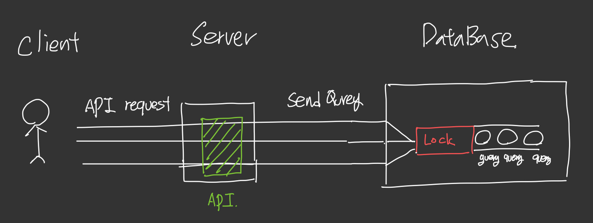
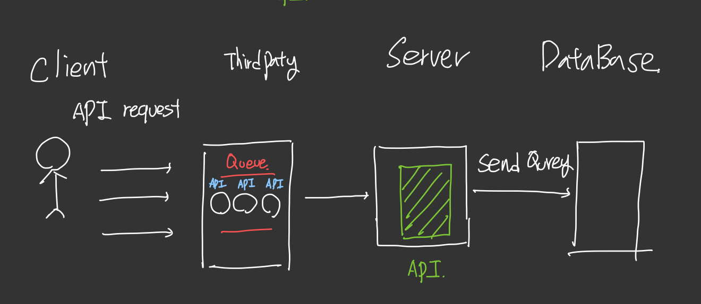
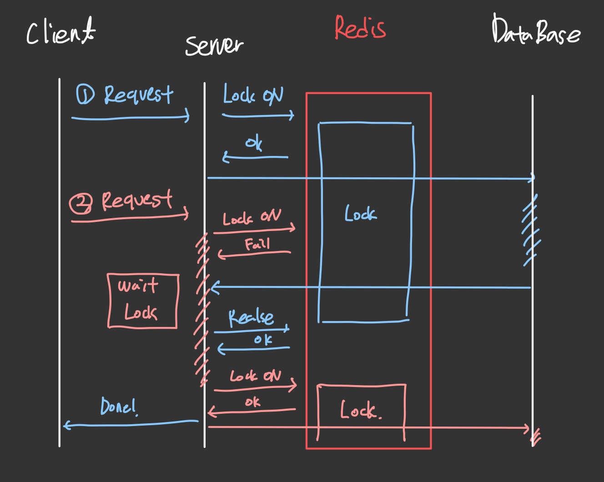
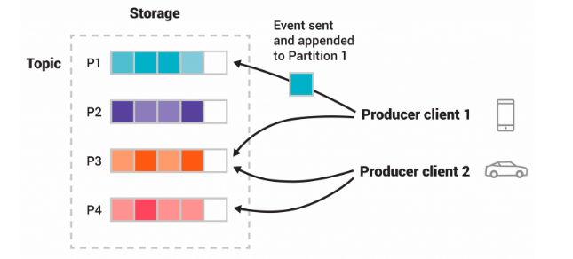

## Intro 
*** 
대규모 트래픽이 몰리게 된다면 경험하게 되는 동시성 이슈!  
지난 프로젝트에서는 동시성을 막기 위한 방법을 배우고 적용해보는 부분이 있었는데   
이에 대한 정리를 하면 좋을 것같아 리뷰하려고 합니다.

 

## 동시성 발생 시나리오 정리
***

해당 서버는 콘서트를 예약하는 시나리오를 갖고 있습니다.  
해당 서버에서 가능한 서비스는 아래와 같습니다.

* 대기열 서비스
* 콘서트
  * 콘서트 날짜 조회 서비스
  * 콘서트 좌석 조회 서비스
  * 콘서트 좌석 예약 서비스
* 결제
  * 콘서트 결제 서비스
* 포인트
  * 포인트 충전 서비스
  * 포인트 조회 서비스

이중에서 가장 동시성 문제가 많이 예상 되는 부분은 첫번째로 `좌석예약 서비스` 입니다.  
해당 서비스는 선착순으로 진행되어야하고 한 사람이 동일한 자원이 한 좌석이 예약을 하는 순간  
다른 예약 시도는 `FAIL` 이 되어야만 하기 때문입니다.

따라서 좌석 예약 시스템을 기준으로 동시성에 필요한 제어 방식을  
분석 해보겠습니다.

> 사실 다른 API 또한 동시성 이슈가 발생할 수 있다고 생각하지만 가장 크게 영향이 있는 부분이 좌석 예약 서비스라 판단

 

## 동시성 제어 방식 종류
***

자료조사의 동시성 제어방식은 2가지로 정리되었습니다.

`Database` 의 `Lock` 기능을 이용한 `DB Lock` 방식  
>  

 

`Redis/ Kafka` 와 같은 `ThirdParty` 의 기능을 이용하여 Lock의 기능을 구현함으로써 동시성을 제어하는 것이 있습니다.  
이를 `분산 LOCK` 이라고도 불립니다.
> 

기준은 동시 요청이 들어왔을 때 데이터를 확보하는 `Lock` 이라는 기능을 어디서 사용할 것인가 입니다.

정리하자면
> 1. 이미 구현되어있는 DataBase 의  Lock 이라는 기술로 동시성을 제어하는 것
> 2. DataBase 에 접근하기 전 API 요청을 순서대로 처리하는 Lock 을 구현할 것

 

### 이제 순서대로 구현 방식을 자세히 알아봅시다.

우선 DataBase Lock 부터 보면 `낙관적 Lock` 과 `비관적 Lock` 2가지 방법이 있습니다.

* ### 낙관적 Lock 
    > 주로 동시성이 충돌이 적은 곳에 사용하며   
    `Version` 이라는 `Row` 을 생성하여   
    `Version` 이 같은 `Transaction` 에 대해서는 전부 `Rollback` 을 하는 경우 사용한다  
     
    즉, 선착순인 하나만 성공시키고 나머지는 모두 Rollback 처리해야하는 경우 사용한다  
    이때 `Rollback` 에 대한 추가 로직을 작성해야한다. ( 경쟁에서 밀릴 경우 )  
      
    대신 트래픽이 많아도 다른 트랜잭션을 대기할 필요없이 전부 Rollback 이 되기 때문에   
    성능이 좋다.

* ### 비관적 Lock
    > 주로 동시성 충돌이 자주 일어나면서 트랜젹선을 모두 처리해야만할 때 사용한다.  
    해당 방식은 다른 트랜잭션이 작업이 끝날때 까지 트랜잭션들이 모두 대기를 한다.  
    때문에 트래픽이 다량으로 밀릴 경우 성능에 대한 이슈가 있으며  
    무한정 대기는 일어나선 안되므로 제한 시간을 꼭 작성해야한다.  
    또한 하나의 트랜잭션이 `commit` 을 한 이후 다음 `Transaction` 에 대한 순서가 보장되어 있지 않을 수 있다.

 

다음은 ThirdParty 를 이용한 분산 Lock 의 종류입니다.

* ### Redis 이용한 Lock 구현 
    
  
  >  그림과 같은 순서도를 가지며 `Redis` 를 이용하여 `key` 의 생명주기를 이용하여 `Lock` 등록하고 `Lock` 을 얻습니다.     
    이때 `Lock` 을 얻을 수 있는 지 확인하는 방식(그림에서 Wait Lock 부분)이 `Spin-Lock`, `Pub/Sub Lock` 방식으로 2가지로 구현할 수 있다.      
    `Spin-Lock` 은 정해진 시간 만큼 대기하는 로직으로 단순히 `Redis` 에 `Lock` 을 얻을 수 있는지
    계속해서 확인하는 방법이다. :: while 을 이용한 무한 루프   
    콘서트 예약 애매할 때 `Polling` 방식으로 계속해서 확인하는 것과 비슷하다         
    `Pub/Sub` 방법은 무한 로딩에 빠질 수도 있는 이 방식을 구독 형식으로 구현한 것이다.  
    `Redis` 에서 `Lock` 이 해제 될때마다 구독하고 있는 `Client` 에게 알려주는 형식으로 
    불필요한 요청을 줄인 방식 이다.  

  

* ### Kafka 를 이용한 Lock 구현
   
  
  > 카프카에서는 `Topic` 마다 `Partition` 이라는 `Queue` 로 분배하여 이벤트를 분배한다.  
  > 이때 각 `Partition` 에 대한 이벤트는 항상 순서를 보장한다.( `Queue` 이기 때문 )  
  > 이점을 이용하여 대기열에 대한 `Topic` 을 하나의 `Partition` 만 두고 `Event` 처리를 한다면 `Lock` 과 동일한 구현을 할 수 있을 것이다.

> 분산락 구현시 고려해야할 부분 TIP!   
> `DB LOCK` 의 무결성을 보장해야하는 것을 무조건 고려해야 한다!  
> `락획득` -> `트랜잭션 시작` -> `로직 수행` -> `트랜잭션 종료` -> `락 해제`  
> 순서를 무조건 지켜야함

  
  
지금까지 `DataBase` 의 `Lock` 과 `분산 Lock` 을 모두 알아보았다.

이제 2가지의 방식의 장단점을 비교하여 해당 프로젝트에 적용해보려고한다.

* 데이터 베이스 `Lock` 장점
  * 장점
    * `ThirdParty` 를 몰라도 구현가능하다
    * 확실한 `LOCK` 처리가 가능하다
    * 구현이 빠르다.
  * 단점
    * Lock 에 대한 이해도가 필요
    * 실수로 조작할시 다른 Query 에도 영향아 있다 - `Table Lock` 조심
    * `DataBase` 에 부하가 커질 우려가 있다.
    * 그로인해 성능이 떨어질 수 있다.
    * `DeadLock` 이 발생하지 않도록 적절한 처리가 필요하다. - 발생시 처리과정이 필요
* 분산 Lock 
  * 장점 
    * `DataBase` 에 트래픽이 몰릴 경우 `DataBase` 부하를 줄일 수 있다
    * `DataBase` 의 여러 트랜잭션이 생길 경우 발생하는 `DeadLock` 상황을 피할 수 있다.
    * `DataBase` 또는 서버 가 하나가 아닌 다중 서버/ 클러스터인 경우 일정하게 보장할 수 있다.
  * 단점
    * `ThirdParty` 에 대한 이해가 있어야 한다.
    * 트랜잭션에 대한 로직을 직접 구현 해야 하므로 구현 난이도가 있다.
    * `ThirdParty` 상태, 네트워크 상태에 따라 안정성이 결정된다.
    * 완벽히 제어할 수 없을 경우를 대비한 추가 로직이 필요하다. (`Event` 수신 실패, `Lock` 얻기 실패 등등)

  

  
 

## 각 방식별 비교 분석
*** 

### DataBase Lock 이용 VS Lock 구현

>  DataBAse Lock 을 선택을 했습니다.

사유는 

> 1. ThirdParty 을 고려할 만한 트래픽 조건 x
> 2. Concert 관련 DB 만 있으므로 DataBase 성능 우려 x 
> 3. 예외 처리 없이 정확해야함

따라서 `DataBase` 의 `Lock` 의 기술을 이용 하는 걸로 정했습니다.

  

### `낙관적 Lock` VS `비관적 Lock` 

> 낙관적 Lock 을 사용하는게 조금 더 알맞다

사유는 
> 다른 트랜잭션이 기다리면서 까지 좌석에 정보를 확인할 필요가 없다.   
> ->  A 좌석을 선택할 수 있냐? 없냐? 2가지 상태만 존재

해당 사유가 더 좌석 예약시 필요한 상황과 알맞기 때문에 낙관적 `Lock` 으로 구현하는걸 선택했습니다.

 

## OUTRO
***
동시성 제어를 위해  
여러 방법들에 대해 분석하고 
적용해야할 API 특성에 대해 정리해보니  
어떤 방법이 적당한지 정합하게 찾을 수 있을 것 같습니다.

서버, 데이터 베이스가 분산되어있지 않고  
구현 난이도가 상대적으로 높지 않아  
좌석 API 낙관적 Lock 을 이용하여 구현하는게 적합합니다.

또한 다음번 Lock 을 구현할 상황이 온다면 충분히 구현해보고도 싶습니다~

